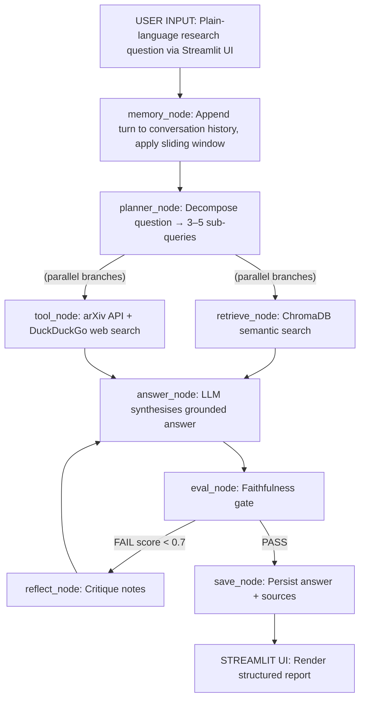

# ARIA: Agentic Research Intelligence Assistant
## Technical Product Requirements Document

**KIIT University · B.Tech CS Capstone**
**April 2026**

**Domain:** Agentic AI / LLM Systems  
**Capstone Type:** LangGraph + RAG + Agentic Orchestration  
**Primary Stack:** Python · LangGraph · ChromaDB · Streamlit  
**Deployment Target:** Streamlit Cloud / HuggingFace Spaces  
**Difficulty:** Medium-Hard (extends base curriculum)  
**Timeline:** 4–5 weeks build + 1 week polish  

---

## 01 Abstract
ARIA (Agentic Research Intelligence Assistant) is a fully autonomous, multi-node LangGraph agent designed to transform how researchers and founders consume technical literature. A user states a research question in plain language; ARIA autonomously plans a multi-step investigation, decomposes it into sub-queries, retrieves grounded context from a ChromaDB knowledge base, executes live web and arXiv searches in parallel, synthesises a structured report, evaluates its own faithfulness via a self-reflection gate, and iterates if quality falls below threshold — all within a stateful, multi-turn conversation session.

The project satisfies all six mandatory capstone capabilities prescribed by the course (LangGraph Workflow, RAG Knowledge Base, Conversation Memory, Self-Reflection, Tool Use, and Deployment) and extends them through a Plan-Execute orchestration pattern, a domain-specific arXiv tool, and a citation-aware Streamlit report UI.

---

## 02 Problem Statement & Motivation
The volume of AI/ML literature has grown at an exponential rate since 2020. Researchers, students, and startup founders face three compounding problems:

**Information Overload**
arXiv alone publishes 500+ ML papers per day. Manual triage is impossible at this velocity. Founders and researchers spend 40–60% of their research time on literature discovery rather than synthesis.

**Grounding Gap**
Existing LLM chatbots hallucinate citations and fabricate paper titles. Without a retrieval-grounded architecture, AI-assisted research cannot be trusted for academic or investment decision-making.

**Context Fragmentation**
Each research query starts from scratch. There is no system that maintains session context, remembers prior findings, and allows iterative drill-down — the way a human research assistant would.

**Why this matters:** ARIA is not a hypothetical tool — it directly accelerates real work and demonstrates the capacity to build production-grade agentic systems.

---

## 03 Project Goals & Success Criteria

| # | Goal | Success Criterion | Priority |
| :--- | :--- | :--- | :--- |
| **G1** | Autonomous research planning | Agent decomposes any question into 3–5 sub-queries without user intervention | P0 |
| **G2** | Grounded answers only | 100% of answers cite at least one ChromaDB or arXiv source | P0 |
| **G3** | Self-correcting quality gate | Faithfulness score gates all answers; retries triggered when score < 0.7 | P0 |
| **G4** | Multi-turn memory | Agent correctly references facts from 3+ prior turns in the same session | P0 |
| **G5** | Live web + arXiv retrieval | arXiv tool returns real paper metadata; DuckDuckGo returns live snippets | P1 |
| **G6** | Non-technical deployment | Any user can run a full research query via Streamlit without touching code | P0 |
| **G7** | Structured report output | Every answer is formatted as: Summary, Key Findings, Sources, Follow-ups | P1 |
| **G8** | Domain configurability | ChromaDB knowledge base is swappable by domain via config.yaml | P2 |

---

## 04 System Architecture Overview
ARIA implements a Plan-Execute-Reflect-Synthesise (PERS) agentic pattern on top of LangGraph's StateGraph API. Unlike simple RAG chains, the architecture has a planning phase that decomposes queries before any retrieval occurs, enabling parallel sub-query execution and genuinely multi-source synthesis.



**Key Architectural Decision: Plan-Execute Pattern**
Unlike simple router → retrieve → answer chains, ARIA inserts a `planner_node` that uses structured LLM output to decompose queries before touching any retrieval. This enables parallel sub-query execution, dramatically improves coverage on complex questions, and is the single biggest differentiator vs. other student projects in this cohort.

---

## 05 LangGraph State Design
The `TypedDict` State is the contract between all nodes. It must be designed before any node is written. Every field that a node reads or writes must appear here.

```python
# aria/state.py
from typing import TypedDict, List, Optional, Annotated
import operator

class ARIAState(TypedDict):
    # Input
    question:        str                    # current user question
    thread_id:       str                    # conversation session ID
    
    # Planning
    sub_queries:     List[str]              # planner decomposition
    route:           str                    # 'retrieve' | 'tool' | 'both'
    
    # Retrieval
    retrieved:       str                    # ChromaDB context chunks
    sources:         List[str]              # source document names
    tool_result:     str                    # arXiv + web search results
    
    # Generation
    answer:          str                    # synthesised LLM response
    report:          dict                   # structured report sections
    
    # Evaluation
    faithfulness:    float                  # quality score 0.0–1.0
    eval_retries:    int                    # safety valve counter
    reflection_note: str                    # critique from reflect_node
    
    # Memory
    messages:        Annotated[List[dict], operator.add]  # full history
    context_window:  List[dict]             # sliding window (last k=10)
```

| Field | Type | Owner Node(s) | Purpose |
| :--- | :--- | :--- | :--- |
| `question` | str | entry / memory_node | User's current input |
| `thread_id` | str | entry | Session identifier for MemorySaver |
| `sub_queries` | List[str] | planner_node | Decomposed sub-questions |
| `route` | str | planner_node | Routing decision for parallel branch |
| `retrieved` | str | retrieve_node | ChromaDB concatenated chunks |
| `sources` | List[str] | retrieve_node | Provenance list for citation |
| `tool_result` | str | tool_node | arXiv + web concatenated results |
| `answer` | str | answer_node / reflect_node | Current best answer |
| `report` | dict | answer_node | Structured sections dict |
| `faithfulness`| float | eval_node | Grounding quality 0–1 |
| `eval_retries`| int | eval_node | Max=2 before force-pass |
| `reflection...`| str | reflect_node | Critique for re-generation |
| `messages` | List[dict] | memory_node / save_node | Full conversation log |
| `context_win...`| List[dict] | memory_node | Sliding window k=10 turns |

---

## 06 Node Specifications

- **memory_node**
  - Reads: question, messages, thread_id
  - Writes: messages (append), context_window (sliding window)
  - Logic: Append current question as HumanMessage. Trim messages to last k=10 pairs. Key rule: MUST run first on every turn.

- **planner_node**
  - Reads: question, context_window
  - Writes: sub_queries (List[str]), route (str)
  - Logic: Prompt LLM with structured output parser to produce 3–5 sub-queries. Route decision: 'retrieve', 'tool', 'both'.

- **retrieve_node**
  - Reads: sub_queries, route
  - Writes: retrieved (str), sources (List[str])
  - Logic: For each sub-query, query ChromaDB collection (top_k=5). Deduplicate. Concat.

- **tool_node**
  - Reads: sub_queries, route
  - Writes: tool_result (str)
  - Logic: Run arXiv API tool + DuckDuckGo search on each sub-query. Merge results.

- **answer_node**
  - Reads: question, retrieved, tool_result, context_window, reflection_note
  - Writes: answer (str), report (dict)
  - Logic: Prompt LLM to synthesise from retrieved + tool_result only.

- **eval_node**
  - Reads: answer, retrieved, tool_result, eval_retries
  - Writes: faithfulness (float), eval_retries (int)
  - Logic: Score overlap between answer tokens and retrieved context using BM25 or LLM-as-judge.

- **reflect_node**
  - Reads: answer, question, faithfulness, retrieved
  - Writes: reflection_note (str), answer (updated critique)
  - Logic: LLM critique prompt — identify unsupported claims, suggest grounded revision.

- **save_node**
  - Reads: answer, report, sources, messages
  - Writes: messages (append), context_window (update)
  - Logic: Persist final report as AIMessage. Update sliding window.

---

## 07 RAG Knowledge Base Design

The ChromaDB knowledge base contains 45+ documents targeting the AI/ML Deep Tech research domain.

| Source | # Docs | Content Type | Load Method |
| :--- | :--- | :--- | :--- |
| arXiv abstracts | 20 | Plain text abstracts | ArxivLoader |
| Attention Is All You Need | 1 | Full paper PDF | PyPDFLoader |
| LangChain / LangGraph docs| 5 | Markdown pages | WebBaseLoader |
| Hugging Face model cards | 10 | JSON → text | Custom loader |
| ARIA domain config | 1 | YAML structured docs | Custom parser |
| Research summaries | 8 | PDF abstracts | PyPDFLoader |

**Chunking Strategy:**
```python
from langchain.text_splitter import RecursiveCharacterTextSplitter
splitter = RecursiveCharacterTextSplitter(
    chunk_size=512,        # optimal for sentence-transformers
    chunk_overlap=64,      # preserve boundary context
    separators=['\n\n', '\n', '. ', ' ', '']
)
```

---

## 08 Tool Registry

| Tool Name | Type | Library | What It Does | Req? |
| :--- | :--- | :--- | :--- | :--- |
| `arxiv_search` | External API | langchain-community | Query arXiv by keyword; returns title, abstract | P0 |
| `web_search` | Web Search | langchain-community | Live web search for news, blogs | P0 |
| `citation_fmt` | Domain Tool | Custom | Format a list of sources into citations | P1 |
| `domain_kb` | Vector Search | ChromaDB | Semantic search over ChromaDB | P0 |
| `date_context` | Utility | Python | Return current date for grounding | P1 |
| `pdf_reader` | File Tool | PyPDFLoader | Accept user PDF and add to Session | P2 |

---

## 09 Self-Reflection & Faithfulness Gate
The self-reflection loop is ARIA's quality assurance mechanism, ensuring every answer is grounded in retrieved context before delivery.

```python
# aria/nodes/eval_node.py
EVAL_PROMPT = '''
You are a faithfulness evaluator. Score how well the answer is grounded in the context on a scale of 0.0 to 1.0.
Rules:
- 1.0 = every claim is supported
- 0.7 = most claims are supported
- 0.5 = significant unsupported claims
- 0.0 = entire hallucination
'''
```

**Evaluation Logic:**
If `score >= 0.7` -> proceed to `save_node`.
If `score < 0.7` -> route to `reflect_node` for critique and re-generation via `answer_node` (max retries = 2).

---

## 10 Conversation Memory Design
Using `MemorySaver` checkpointer, state persistence is keyed by Streamlit's unique `thread_id`. The sliding window guarantees the context window never exceeds LLM token limits, retaining the last 10 message pairs (`WINDOW_SIZE * 2` entries).

---

## 11 Streamlit Deployment
The Streamlit UI enables non-technical users to run full research sessions.
- **Sidebar**: Session management, domain selector.
- **Thinking Expander**: Collapsible display of sub-queries.
- **Report Card**: Structured JSON renderer for Summary, Findings, Sources.
- **Faithfulness Badge**: Green/Amber/Red scores on quality.
- **Source Explorer**: Citations dropdown.

---

## 12 Tech Stack & Dependencies

| Layer | Technology | Version | Purpose |
| :--- | :--- | :--- | :--- |
| Orchestration | LangGraph | >=0.2.0 | StateGraph, MemorySaver |
| LLM | google-genai / groq | latest | Gemini Flash or Llama-3.3-70B |
| Embeddings | sentence-transformers| >=2.6 | all-MiniLM-L6-v2 |
| Vector DB | chromadb | >=0.5 | Persistent local collection |
| UI | streamlit | >=1.35 | Frontend on Streamlit Cloud |
| Type Safety | pydantic | >=2.0 | Structured outputs |

---

## 13 Mandatory Capability Compliance Matrix

| # | Capability | ARIA Implementation | Status |
| :---| :--- | :--- | :--- |
| **1** | LangGraph Workflow | 7-node StateGraph: memory → planner → retrieve/tool → answer → eval → reflect | PASS |
| **2** | RAG Knowledge Base | 45+ documents across 6 source types in ChromaDB; grounded synthesis | PASS |
| **3** | Conversation Memory| MemorySaver checkpointer per Streamlit session with sliding window | PASS |
| **4** | Self-Reflection | `eval_node` scores faithfulness 0-1, tracking LLM hallucinations and retrying | PASS |
| **5** | Tool Use | arXiv search, web search via DuckDuckGo, citation formatter | PASS |
| **6** | Deployment | Full Streamlit app with chat UI, report cards, and export via Streamlit Cloud | PASS |

---

## 14 Implementation Roadmap
- **Week 1:** Foundation & State Design, ChromaDB initialisation.
- **Week 2:** Core Nodes: Planner + Retrieval, StateGraph wiring.
- **Week 3:** Tools + Self-Reflection Loop.
- **Week 4:** Memory + Streamlit UI, history persistence.
- **Week 5:** Polish, Testing & Deployment.

---

## 15 File Structure
```text
aria/
├── app.py                        # Streamlit entry point
├── requirements.txt              # All dependencies pinned
├── config.yaml                   # Domain + model config
├── .env.example
├── aria/
│   ├── state.py                  # ARIAState TypedDict
│   ├── graph.py                  # build_graph()
│   ├── knowledge_base.py
│   ├── nodes/
│   ├── tools/
│   └── prompts/
├── data/
│   ├── raw/
│   └── chroma_db/
└── tests/
```

---

## 16 Risk Register

| Risk | Likelihood | Impact | Mitigation |
| :--- | :--- | :--- | :--- |
| LLM API rate limits hit | Medium | High | Use generous free tiers + response cache |
| arXiv/DuckDuckGo empty | Low | Medium | Fallback to KB-only retrieval |
| Faithfulness loop stuck | Low | High | `eval_retries` cap at 2 → force pass flag |
| ChromaDB cold start delay| Medium | Medium | Pre-build and commit `chroma_db/` to repo |
