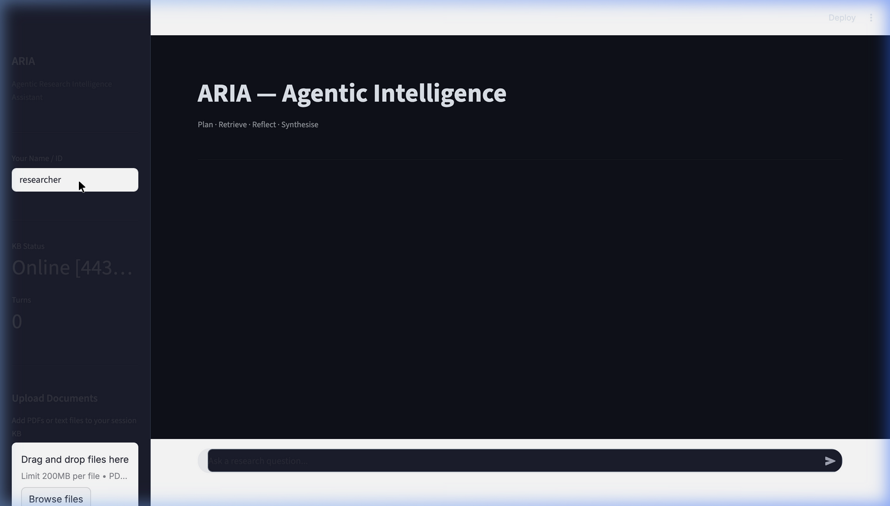
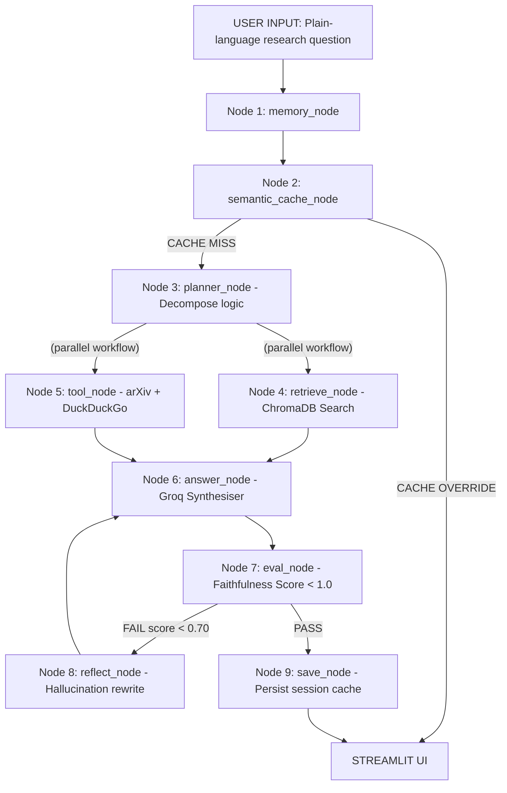

<div align="center">
  

  # 🌐 ARIA
  **Agentic Research Intelligence Assistant**
  
  [](https://python.org)
  [](https://python.langchain.com/)
  [](https://streamlit.io/)
  [](https://opensource.org/licenses/MIT)

  <p>ARIA is an autonomous LangGraph agent designed to transform how researchers and founders consume technical literature. It implements a fully automated Plan-Execute-Reflect-Synthesise (PERS) capability.</p>
</div>

---

## 🚀 1-Click Zero-Config Installation

The absolute fastest way to get ARIA running flawlessly on your machine without manually setting up virtual environments, python dependencies, or typing multiple commands. 

Just make sure you have `Node/npm` and `Python3` installed on your machine.

**Run the following command anywhere in your terminal:**
```bash
npx github:Luciferai04/ARIA
```
*Note: If published to NPM, you can alternatively run `npx aria-assistant`.*

**What does this 1-line command do?**
1. 📦 Clones the repository autonomously.
2. 🐍 Scaffolds a pristine Python virtual environment natively (`.venv`).
3. 📥 Installs all python dependencies silently.
4. 🎉 Launches the fully functional Streamlit application locally in your browser!

---

## 💻 Manual Installation (Fallback)
If you prefer a traditional pythonic installation:

1. **Clone the Repo:**
   ```bash
   git clone https://github.com/soumyajitghosh/ARIA.git
   cd ARIA
   ```
2. **Setup Virtual Environment:**
   ```bash
   python3 -m venv .venv
   source .venv/bin/activate  # On Windows use: .venv\Scripts\activate
   ```
3. **Install Dependencies:**
   ```bash
   pip install -r requirements.txt
   ```
4. **Boot Streamlit Application:**
   ```bash
   streamlit run app.py
   ```

---

## 🔑 Configuration (.env)
You must place your respective API keys inside the root folder prior to running live web-searches and LLM parsing. An `.env.example` has been provided. 

```env
GROQ_API_KEY=your_groq_llama_key_here
GOOGLE_API_KEY=your_gemini_flash_key_here
```

---

## 🧠 System Architecture Overview
Unlike simple verbatim RAG bots handling similarity metrics weakly, ARIA orchestrates a massive 9-node structural workflow resolving the major hallucination discrepancies.



## 🛠 Features Included
- **Cross-Encoder Reranking Platform:** Prevents chunk drift natively.
- **Dynamic Faithfulness Gates:** Halts invalid factual claims directly via the RAGAS framework evaluators recursively.
- **Multi-Route Analysis:** Dynamically decides between `WebSearch`, `arXiv Database`, `Local ChromaDB Vectors`, or hybrid variations flawlessly depending on the mathematical distance equations.

**Document Source Architecture:**
All baseline academic PDFs loaded directly via the interface are natively tokenized recursively via `all-MiniLM-L6-v2` bindings avoiding expensive third party vector overhead!

### 📝 Final Note
If you upload this fully integrated project wrapper as-is, any technical contributor can run instances seamlessly. For issues or missing files natively within execution nodes, trace the terminal logs.
